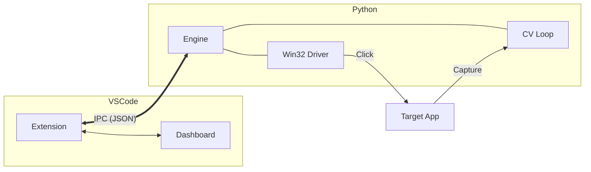

# Project Architecture: Antigravity Auto-Accept

Antigravity Auto-Accept is a professional-grade automation utility that bridges VS Code's environment with a computer-vision-powered background engine.

## 🏗️ System Overview

The system operates as a hybrid architecture:
1.  **Orchestration Layer**: A VS Code extension manages user settings, the process lifecycle, and real-time status reporting.
2.  **Vision & Execution Layer**: A Python engine handles high-frequency screen scanning, template matching, and stealth UI interaction via Win32 messaging.

## 🧩 Main Components

### 1. VS Code Extension (Frontend)
- **Extension Core**: Manages the Python process and IPC state.
- **Sidebar Dashboard**: Provides an interactive view for saved clicks and performance metrics.
- **Status Bar Integration**: Quick toggling and visibility.

### 2. Python Backend (Engine)
- **Computer Vision Loop**: Uses OpenCV and PyAutoGUI to find target elements in near real-time.
- **Win32 System Driver**: Posts hardware messages directly to window handles to execute background clicks without disrupting the user.
- **IPC Interface**: Communicates with the extension via JSON-framed standard input/output.

## 🛠️ Technology Stack
- **Languages**: TypeScript (Frontend), Python 3.13 (Backend).
- **Automation**: PyAutoGUI, OpenCV, PyGetWindow.
- **System APIs**: Windows GDI32, User32 (via `ctypes`).

## 🔄 Data Flow

